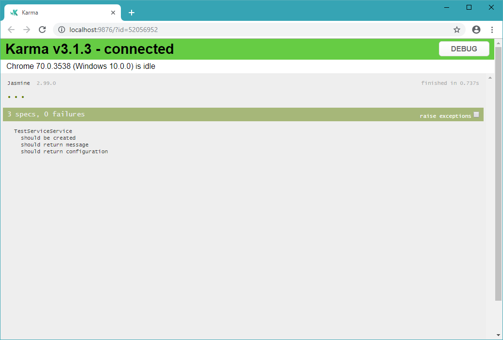

# Unit testing Angular app with node.js, karma, jasmine
This is an example of component testing of an angular application (7.0.0) using node js as mocking of the backend.

# Introduction

If an application written in angular-cli needs to be tested, `mocks are usually used, embedded into the application`. But there is a way to test an application using a `stub server` (on the node js) as a mock to which http requests will be sent, which will make it more flexible to check http services.

The angular application was generated with `angular-cli`.

# Install 

To run the tests you need to run several npm commands:

`npm install` - for install npm packages

`npm run stubServer` - for start stub server

`npm run test` - for starting test of angular cli

# What tests are tested?

This application has a service ([test-service-service](./src/app/test-service.service.ts)) that has 2 methods:
* getMessage(): string - return static text
* getConfiguration(): Observable<ConfiguratoinModel> - makes http request to stub server for configuration and gets json
  
[The test file](./src/app/test-service.service.spec.ts) runs tests for these 2 methods. Since **the stub server is turned on before running the tests**, during the method check, the test passes successfully:



# Stub server configuration
In order for [the stub server](./stub-server/index.js) to work during the test run, add access control origins to headers:

```js
res.setHeader('Access-Control-Allow-Origin', 'http://localhost:4200'); //angular application host
res.setHeader('Access-Control-Allow-Origin', 'http://localhost:9876'); //karma host
```
